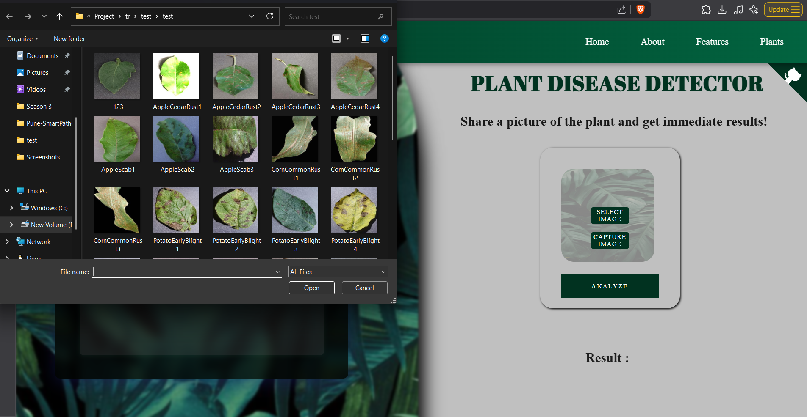
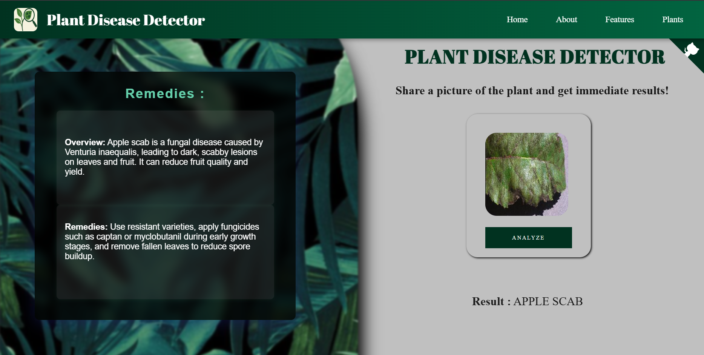
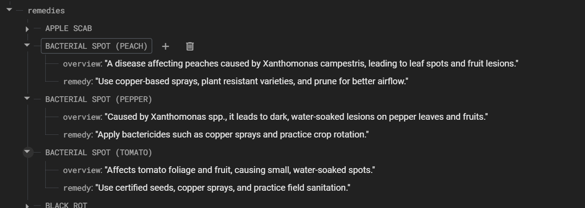

# 🌿 Plant Disease Detection with Firebase Integration

This project is a deep learning-powered web application for detecting plant diseases from images. It uses a trained PyTorch `.pkl` model hosted on Google Drive, and stores disease information using Firebase Realtime Database.

---

## 🚀 Features

- 🔍 Predict plant diseases from leaf images using a `.pkl` model
- ☁️ Load the model from Google Drive at runtime (no local model file required)
- 🔄 Use Firebase Realtime Database to store and retrieve disease info
- 🧪 FastAPI/Flask server to serve predictions and connect to frontend

---

## 📁 Project Structure

```
project/
├── app/
│   ├── static/
│   ├── view/
│   ├── server.py        # Backend server
│   ├── client.js        # Frontend JS logic
├── db/
│   └── firebase_key.json  # Firebase service account key (ignored)
├── model/
│   └── <model is downloaded from Google Drive>
├── .env
├── .gitignore
└── README.md
```

---

## ⚙️ Setup Guide

### ✅ 1. Clone the Repository

```bash
git clone https://github.com/yourusername/your-repo.git
cd your-repo
```

---

### 🔑 2. Generate Firebase Service Account Key

1. Go to [Firebase Console](https://console.firebase.google.com)
2. Project Settings → **Service Accounts**
3. Click **Generate New Private Key**
4. Download the `.json` file
5. Save it to the `db/` folder as:

```
db/firebase_key.json
```

6. Add to `.gitignore` to prevent leaks:

```bash
echo "db/firebase_key.json" >> .gitignore
```

---

### 🔐 3. Create a `.env` File

Create a `.env` file in the root:

```
MODEL_GDRIVE_URL=https://drive.google.com/uc?id=<your_model_id>
FIREBASE_DB_URL=https://your-project-id.firebaseio.com/
```

✅ This keeps credentials and URLs secure and separate from code.

---

### 📦 4. Install Requirements

```bash
pip install -r requirements.txt
```

Or manually install:

```bash
pip install fastapi uvicorn python-dotenv firebase-admin torch torchvision fastai
```

---

### 📥 5. Upload `.pkl` Model to Google Drive

1. Upload your trained model (e.g., `plant_model.pkl`) to Google Drive
2. Get the **file ID** from the shareable link:
   ```
   https://drive.google.com/file/d/FILE_ID/view?usp=sharing
   ```
3. Construct a direct download link:
   ```
   https://drive.google.com/uc?id=FILE_ID
   ```
4. Store this URL in your `.env` as `MODEL_GDRIVE_URL`

---

### ⚙️ 6. Initialize Firebase in `server.py`

In your `server.py`:

```python
import firebase_admin
from firebase_admin import credentials, db
from dotenv import load_dotenv
import os

load_dotenv()
cred = credentials.Certificate("db/firebase_key.json")
firebase_admin.initialize_app(cred, {
    'databaseURL': os.getenv("FIREBASE_DB_URL")
})
```

---

### 📤 7. Load the Model from Google Drive

In `server.py`, use:

```python
import requests
import os

def download_model():
    model_url = os.getenv("MODEL_GDRIVE_URL")
    response = requests.get(model_url)
    with open("model.pkl", "wb") as f:
        f.write(response.content)

download_model()
learn = load_learner("model.pkl")
```

---

### 🏁 8. Run the Server


```bash
python app/server.py
```

Then open:  
👉 `http://127.0.0.1:8000` or `localhost:5000`

---

"""
## 🔁 Sample Flow: How the System Works

This section outlines the typical flow from uploading an image to displaying the result.

---

### 🖼️ 1. Upload an Image via the Frontend

- The user accesses the web interface and selects a leaf image to upload.
- The image is submitted through a form or drag-and-drop UI to the backend.

---

### 🧠 2. Server Sends Image to the `.pkl` Model

- The backend (Flask or FastAPI) receives the image.
- The image is preprocessed (resized, normalized) to match the input expected by the model.
- The `.pkl` model, loaded from Google Drive, receives the image and makes a prediction.

---

### 🩺 3. Model Predicts the Disease

- The trained PyTorch model returns the predicted disease class (e.g., "Tomato Leaf Mold").
- The prediction is converted into a human-readable disease name.

---

### ☁️ 4. Firebase Database Is Queried

- The server uses the disease name to fetch additional details from the Firebase Realtime Database.
- These details can include:
  - A brief overview of the disease
  - Suggested remedies and treatments
  - Disease severity or warning levels

---

### 🌐 5. Display the Result on the Webpage

- The frontend receives the response from the backend.
- It dynamically displays the:
  - Disease name
  - Overview and symptoms
  - Suggested treatments

This makes it easy for farmers or users to understand and take action quickly.

---
"""

---
## 🖼️ Application Screenshots


### 📤 Uploading a Leaf Image


---


### 🔍 Results


---

### 🌿 Firebase Realtime DB Structure


---

## 📊 Model Architecture


---

## 🛡️ Security Tips

- Never commit `firebase_key.json`
- Add it to `.gitignore` and `.gcloudignore`
- Use `.env` for sensitive data (URLs, API keys)
- Revoke and regenerate leaked keys from Firebase Console

---

## 🧼 Cleaning Secrets (if needed)

If you ever accidentally commit secrets:

```bash
git rm --cached db/firebase_key.json
git commit -m "Remove secret"
git filter-repo --path db/firebase_key.json --invert-paths
git push --force
```


---

## 🙌 Credits

Built by **Onkar Patil**  
🌿 Powered by FastAI + Firebase + Google Drive

---

## 📜 License

Free to use, modify, and share.